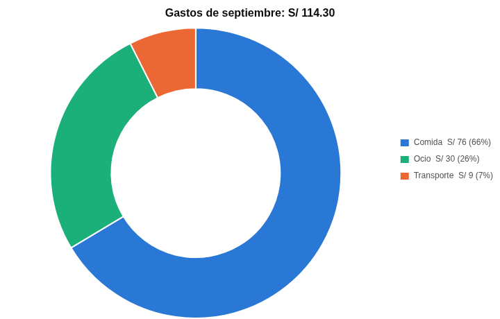
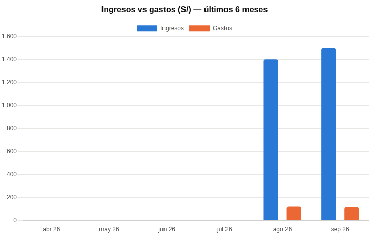
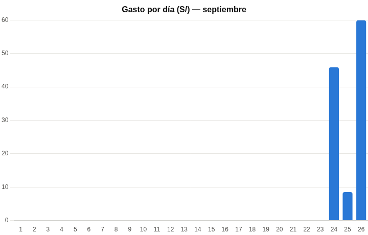
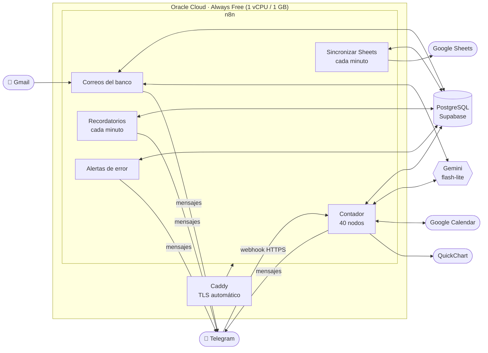
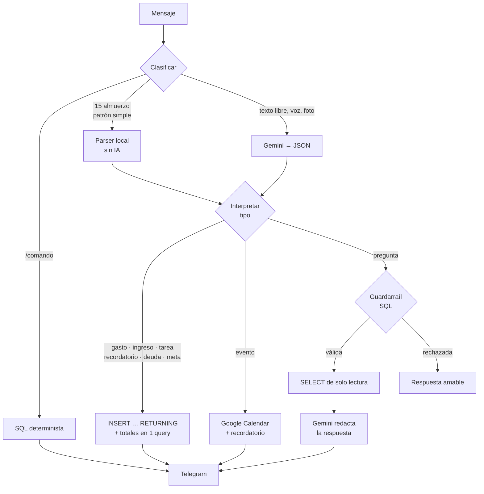

#  n8n Finance Assistant

**Asistente personal de finanzas y productividad en Telegram, construido sobre n8n, PostgreSQL y Gemini. Corre 24/7 por $0 al mes.**


Le escribo al bot como le escribiría a una persona (*"15 almuerzo"*, *"recuérdame pagar la luz el viernes"*, *"¿cuánto gasté en taxi este mes?"*), le mando una nota de voz o una captura de Yape, y él registra, clasifica, responde y me avisa. Los consumos que llegan al correo del banco se registran solos. Todo termina en una hoja de Google Sheets con fórmulas que abro desde el celular.

> **English summary.** This project is a personal finance and productivity assistant on Telegram. It's built as 5 n8n workflows on top of PostgreSQL, with Gemini used as an intent classifier and as a guarded text-to-SQL engine. It logs expenses from free text, voice notes, payment screenshots and bank emails. It handles reminders, tasks, Google Calendar events, debts and savings goals. It answers natural-language questions about your own data and keeps a live Google Sheet in sync. It runs 24/7 on Oracle Cloud's free tier, behind Caddy/HTTPS. Workflow logic lives in plain JavaScript under `src/`, gets compiled into importable n8n JSON, and is covered by 22 integration tests against a real Postgres in CI.

---

## Qué hace

| | |
|---|---|
|  **Registro de gastos** | Texto libre (`taxi 12.50`, `ayer 30 cine`), **nota de voz**, **captura de Yape** o **varios en una frase** (`15 almuerzo, 10 taxi y 5 gaseosa`). |
|  **Correos del banco** | Lee las notificaciones de consumo de Gmail, extrae monto y comercio, y los registra sin duplicar. |
|  **Presupuestos y recurrentes** | Límite mensual por categoría con avisos al 80 % y al 100 %. Pagos fijos (Spotify, alquiler) que se cargan solos el día que tocan. |
|  **Reportes** | Resumen diario, semanal y de cierre de mes. Gráficos (`/grafico`) y exportación a Excel (`/excel mesanterior`). |
|  **Agenda** | Recordatorios con repetición (diario, semanal, mensual, días laborables), tareas con prioridad y eventos en **Google Calendar**. Agenda a las 7 am con el clima y revisión semanal el domingo. |
|  **Deudas y metas** | *"Le presté 50 a Juan"* → saldo por persona. *"Quiero ahorrar 2000 para una laptop"* → barra de progreso. |
|  **Preguntas libres** | *"¿Qué tareas tengo hoy?"*, *"¿cuánto gasté en Uber este mes?"*. El modelo escribe el SQL, un guardarraíl lo valida y la respuesta vuelve en lenguaje natural. |
|  **Google Sheets en vivo** | Hoja "Mis finanzas" con fórmulas y dashboard, sincronizada desde la base cada minuto. También sirve de backup. |
|  **Alertas** | Si cualquier workflow falla, llega un aviso a Telegram con el nodo, el error, una pista de solución y el link a la ejecución. |

<p align="center">
  
  
  
</p>

---

## Arquitectura



Son cinco workflows independientes que solo se comunican a través de la base de datos. Cada uno puede caerse o redeployarse sin afectar a los demás, y el workflow de alertas está configurado como *Error Workflow* de los otros cuatro.

### Flujo de un mensaje



---

## Decisiones de ingeniería

Un bot de gastos es un proyecto común. Lo que me interesaba era resolver bien los problemas que aparecen cuando uno lo usa de verdad todos los días.

### 1. La IA clasifica, el código decide

Gemini no ejecuta nada. Recibe el mensaje y devuelve **un JSON con un esquema fijo** (`tipo`, `monto`, `categoria`, `cuando`, `tareas[]`, `sql`…). A partir de ahí todo es código determinista:

- Valida los tipos, normaliza la categoría contra una lista cerrada y redondea montos.
- Si el modelo manda un recordatorio con fecha en el pasado, se corre al siguiente ciclo.
- Si responde algo inválido, el usuario recibe un mensaje de ayuda, no un error.

Los mensajes triviales (`15 almuerzo`, `taxi 12.50`) **ni siquiera llegan al modelo**: un parser local los resuelve. Eso ahorra cuota y latencia. Tiene guardas para no confundir *"recuérdame pagar 80 de luz"* con un gasto de S/ 80.

### 2. Text-to-SQL con guardarraíles

Para las preguntas libres, el modelo recibe el esquema de las tablas y escribe un `SELECT`. Antes de ejecutarlo, [`sqlSeguro()`](src/contador/interpretar.js) aplica estas reglas:

- Solo acepta `SELECT` o `WITH`, y una sola sentencia.
- Rechaza cualquier palabra de escritura o DDL, **incluso dentro de un CTE** (`WITH d AS (DELETE …) SELECT …`).
- Bloquea funciones y catálogos del sistema (`pg_*`, `information_schema`, `dblink`, `set_config`…).
- Exige `chat_id = <usuario>` en la consulta.
- La envuelve en una subconsulta con `LIMIT 50` y la agrega a JSON.

Los tests prueban cada vector de ataque ([`contador.test.js`](tests/contador.test.js)).

### 3. Una sola ida a la base por mensaje

Cada registro es **un único statement**: `WITH ins AS (INSERT … RETURNING *) SELECT …`. Inserta y en la misma consulta devuelve lo que el mensaje de confirmación necesita:

- total de hoy;
- total del mes;
- avance del presupuesto de esa categoría;
- saldo con esa persona o progreso de la meta.

No hay condiciones de carrera y sale un solo round-trip hacia Supabase.

### 4. Deduplicación de correos del banco

Un consumo puede llegar dos veces, o puedo haberlo anotado a mano antes de que llegue el correo. Se cubre en dos capas:

- **Índice único** sobre `gastos.email_id` con `ON CONFLICT DO NOTHING`: el mismo correo nunca entra dos veces.
- **Ventana de tolerancia**: si ya existe un gasto del mismo monto en una ventana de ±20 minutos, el correo se descarta.

### 5. Sincronización a Google Sheets por huella

Reescribir la hoja cada minuto gastaría cuota de la API. Por eso la consulta arma todo el contenido como un único JSON, calcula su `md5()` y **solo devuelve filas si la huella cambió** respecto a `sync_estado`. Casi siempre la ejecución termina en la primera query sin llamar a Google. Cuando sí hay cambios:

- Se hace `batchClear` + `batchUpdate` en una llamada por hoja.
- Las fechas van como número de serie, así las fórmulas funcionan sin importar el idioma de la hoja.
- La sincronización es en una sola dirección: la base es la fuente de verdad.

### 6. Recordatorios que no se acumulan

El despachador corre cada minuto. Si el servidor estuvo apagado tres días, un recordatorio diario no manda tres avisos atrasados: `generate_series` calcula la **próxima ocurrencia futura** y marca el aviso como enviado en la misma sentencia. Los días laborables se resuelven con `isodow` en la zona horaria de Lima.

### 7. Alertas sin spam

Las alertas pasan por un upsert sobre la tabla `alertas` con clave *(workflow, nodo, error)*:

- La misma falla avisa **una vez cada 30 minutos**.
- Una falla distinta avisa al instante.
- Si la propia base está caída, la alerta sale igual.
- Cada error conocido (token vencido, cuota 429, permisos 403) trae una pista de cómo resolverlo.

### 8. Infraestructura de $0

| Pieza | Servicio | Costo |
|---|---|---|
| Servidor | Oracle Cloud Always Free, `VM.Standard.E2.1.Micro` + 2 GB de swap | $0 |
| HTTPS | Caddy + Let's Encrypt, dominio de DuckDNS | $0 |
| Base de datos | Supabase (Postgres, *session pooler*, RLS activado) | $0 |
| LLM | Gemini `flash-lite` (capa gratuita) | $0 |
| Gráficos | QuickChart (Chart.js v4) | $0 |

n8n se configura para **no guardar ejecuciones exitosas** de los workflows que corren cada minuto. Así la base de n8n no crece sin control en una VM de 1 GB.

---

## Modelo de datos

```mermaid
erDiagram
    gastos {
        bigserial id PK
        timestamptz fecha
        numeric monto
        text categoria
        text metodo "manual·voz·yape·correo·recurrente"
        text email_id UK "dedupe de correos"
        bigint chat_id
    }
    ingresos { bigserial id PK
        numeric monto
        bigint chat_id }
    presupuestos { bigint chat_id PK
        text categoria PK
        numeric monto }
    recurrentes { bigserial id PK
        smallint dia
        text ultimo_mes "evita doble cargo" }
    recordatorios { bigserial id PK
        timestamptz cuando
        text repetir "diario·semanal·mensual·laborables" }
    tareas { bigserial id PK
        smallint prioridad
        date vence
        boolean hecha }
    deudas { bigserial id PK
        text persona
        numeric monto "+ te deben / − debes" }
    metas { bigserial id PK
        numeric objetivo
        numeric ahorrado }
    sync_estado { text clave PK
        text hash "md5 de lo enviado a Sheets" }
    alertas { text clave PK
        timestamptz ultima
        int veces }
```



Esquema completo e idempotente en [`database/schema.sql`](database/schema.sql).

---

## Estructura del repo

```
src/                 JavaScript de cada nodo Code, editable y testeable fuera de n8n
  contador/          bot principal: clasificar → IA → interpretar → SQL → responder
  recordatorios/     despachador de cada minuto
  correos/           parser de correos del banco
  sheets/            sincronización con Google Sheets
  alertas/           Error Workflow
  shared/            helpers SQL compartidos (zonas horarias, rangos de fechas)
build/build.js       compila src/ → workflows/*.json (nodos, conexiones, reintentos)
workflows/           JSON listos para importar en n8n
database/schema.sql  tablas, índices y RLS
infra/               docker-compose + Caddyfile para el servidor
sheets/              plantilla "Mis finanzas.xlsx" (y el script que la genera)
tests/               tests de integración contra Postgres real
```

**Por qué `src/` + build, y no editar en n8n:** el editor de n8n es cómodo para prototipar, pero no deja versionar, hacer diff ni testear. Aquí cada nodo Code es un archivo `.js`. `build.js` arma los workflows con fábricas de nodos (reintentos de la IA, `onError`, credenciales y posiciones consistentes) y genera IDs deterministas para que el diff de git quede limpio.

## Tests

```bash
npm install
PGHOST=localhost PGUSER=postgres PGPASSWORD=postgres PGDATABASE=postgres npm test
```

Un harness ejecuta el código de los nodos tal como lo haría n8n, simulando `$input`, `$('Nodo')`, `$now` y `DateTime`. Corre contra un **Postgres real** y con respuestas de Gemini simuladas. Cubre 22 casos:

- Ruta rápida sin IA, varios gastos o tareas en una frase y avisos de presupuesto.
- Seis ataques al guardarraíl de text-to-SQL.
- Deduplicación de correos y recordatorios que no se acumulan.
- Sincronización de Sheets solo con cambios y anti-spam de alertas.

Corren en GitHub Actions en cada push.

## Montarlo tú mismo

Guía paso a paso en [`docs/setup.md`](docs/setup.md). En resumen:

1. Crear la VM gratis en Oracle Cloud, apuntar un subdominio de DuckDNS y levantar [`infra/`](infra) con `docker compose up -d`.
2. Correr [`database/schema.sql`](database/schema.sql) en Supabase.
3. Importar los 5 JSON de [`workflows/`](workflows) y conectar las credenciales (Telegram, Postgres, Gemini, Google).
4. Reemplazar los placeholders `TU_CHAT_ID`, `PON_AQUI_EL_CORREO_DEL_BANCO`, `PEGA_AQUI_EL_ID_DE_TU_HOJA` y `TU-DOMINIO`.

## Stack

n8n · PostgreSQL (Supabase) · Google Gemini · Telegram Bot API · Gmail / Google Calendar / Google Sheets API · QuickChart · Docker · Caddy · Oracle Cloud · Node.js (`node:test`, `pg`, `luxon`) · Python (`openpyxl`) · GitHub Actions

---

Hecho por **José Falcón** · [MIT](LICENSE)
